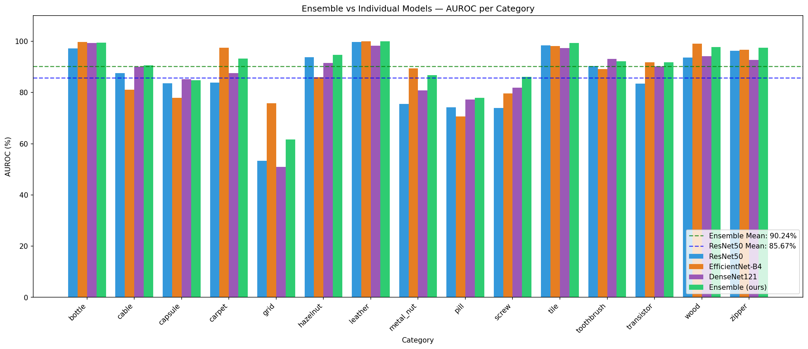
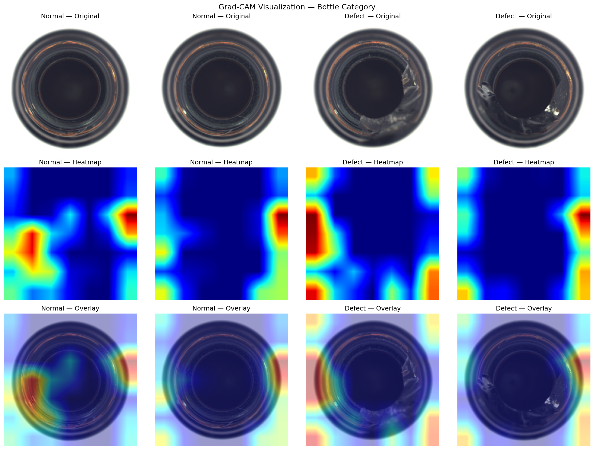

# Automotive Surface Defect Detection

Anomaly detection in industrial components using ensemble deep learning 
on the MVTec Anomaly Detection dataset.

## Results

| Model | Mean AUROC |
|---|---|
| ResNet50 | 85.67% |
| DenseNet121 | 87.38% |
| EfficientNet-B4 | 88.83% |
| **Ensemble (ours)** | **90.24%** |

## Defect Localization (GRAD-CAM)

## Key Finding
Ensemble of ResNet50 + EfficientNet-B4 + DenseNet121 feature extractors 
achieves 90.24% mean AUROC, outperforming all individual models by up to +4.57%.

## Dataset
MVTec AD — 15 categories, 5000+ images, pixel-level annotations

## Setup
pip install -r requirements.txt

## Method
1. Extract features from normal training images using pretrained CNN backbones
2. Build nearest-neighbor memory bank of normal features  
3. At test time compute distance to nearest normal feature as anomaly score
4. Ensemble scores from multiple backbones for robust detection
